## Short Bio

I am an Assistant Researcher (2024-) in the [School of Computer Science](https://cs.nju.edu.cn/main.htm) at [Nanjing University](http://www.nju.edu.cn/). I am a member of [DisLab](http://dislab.nju.edu.cn). 
Previously, I received my Ph.D. (2018-2024) from [Nanjing University](http://www.nju.edu.cn/), advised by  Prof. [Lei Xie](https://cs.nju.edu.cn/lxie/index.htm). 
I was fortunate to visit [Nanyang Technological University](https://www.ntu.edu.sg) (2022-2023), working closely with Prof. [Jun Lup](https://personal.ntu.edu.sg/junluo/. 

My research interests include machine learning and its applications in computer vision, currently focusing on continual learning, pre-trained model reuse, and multimodal large language models.

<!-- 

  <i class="fa-regular fa-bell"></i>&nbsp;
I am looking for highly self-motivated students. Please drop me an email with your resume and transcript if you are interested in working together with me.

 -->

## News

  <li>[2024-09] One paper about class-incremental learning with PTM is accepted to <a href="https://link.springer.com/journal/10994" target="_blank">MLJ</a>.</li>
  <li>[2024-08] One paper about <a href="http://arxiv.org/abs/2303.07338" target="_blank">class-incremental learning with PTM</a> is accepted to <a href="https://link.springer.com/journal/11263" target="_blank">IJCV</a>.</li>
  <li>[2024-07] One survey about <a href="https://arxiv.org/abs/2302.03648" target="_blank">class-incremental learning</a> is accepted to <a href="https://ieeexplore.ieee.org/xpl/RecentIssue.jsp?punumber=34" target="_blank">TPAMI</a>.</li>
  <li> [2024-06] One paper about multilingual MLLM is uploaded to <a href="https://arxiv.org/abs/2406.02539" target="_blank">arXiv</a>.</li>
  <li> [2024-05] Successfully defended my Ph.D. dissertation. </li>
  <li> [2024-05] Recognized as <a href="https://cvpr.thecvf.com/Conferences/2024/ProgramCommittee#outstanding-reviewers" target="_blank">CVPR 2024 Outstanding Reviewer</a>.</li>
  <li> [2024-05] One paper about <a href="https://openreview.net/forum?id=aksdU1KOpT" target="_blank">class-incremental learning</a> is accepted to <a href="https://icml.cc/" target="_blank">ICML 2024</a>.</li>
  <li>[2024-04] One survey about <a href="https://arxiv.org/abs/2401.16386" target="_blank">PTM-based continual learning</a> is accepted to <a href="https://ijcai24.org/" target="_blank">IJCAI 2024</a>.</li>
  <li> [2024-02] One paper about <a href="https://arxiv.org/abs/2403.12030" target="_blank">class-incremental learning</a> is accepted to <a href="http://cvpr2024.thecvf.com/" target="_blank">CVPR 2024</a>.</li>
  <li> [2023-11] Recognized as <a href="https://neurips.cc/Conferences/2023/ProgramCommittee#top-reivewers" target="_blank">NeurIPS 2023 Top Reviewer</a>.</li>
  <li>[2023-09] One paper about <a href="  https://openreview.net/forum?id=8NAxGDdf7H" target="_blank">few-shot class-incremental learning</a> is accepted to <a href="https://neurips.cc/Conferences/2023" target="_blank">NeurIPS 2023</a>.</li>
  <li>[2023-09] We have released <a href="https://github.com/sun-hailong/LAMDA-PILOT" target="_blank">PILOT toolbox</a> for class-incremental learning with pre-trained models (<a href="https://arxiv.org/abs/2309.07117" target="_blank">technical report</a>). </li>
  <li>[2023-09] One paper about <a href="http://arxiv.org/abs/2106.08112" target="_blank">contextualized meta-learning</a> is accepted to <a href="https://ieeexplore.ieee.org/xpl/RecentIssue.jsp?punumber=34" target="_blank">TPAMI</a>.</li>
  <li>[2023-08] We are hosting the <a href="#tutorials"> tutorial </a> (<a href="./file/cl_tutorial.pdf" target="_blank">slides</a>) on continual learning at <a href="https://ijcai-23.org/tutorials/" target="_blank">IJCAI 2023</a>.</li>
  <li>[2023-05] One paper about class-incremental learning with VLM is uploaded to <a href="https://arxiv.org/abs/2305.19270" target="_blank">arXiv</a>.</li>
  <li>[2023-01] Two papers about class-incremental learning are accepted to <a href="https://iclr.cc/" target="_blank">ICLR 2023</a> (one <a href="https://openreview.net/forum?id=S07feAlQHgM" target="_blank">spotlight</a>).</li>
  <li>[2022-10] Our <a href="https://github.com/G-U-N/PyCIL" target="_blank">toolbox for class-incremental learning (PyCIL)</a> is accepted to <a href="https://www.sciengine.com/SCIS/home" target="_blank">SCIS</a>.</li>
  <li>[2022-08] One paper about <a href="https://ieeexplore.ieee.org/document/9864267" target="_blank">few-shot class-incremental learning</a> is accepted to <a href="https://ieeexplore.ieee.org/xpl/RecentIssue.jsp?punumber=34" target="_blank">TPAMI</a>.</li>
  <li>[2022-07] One paper about <a href="https://arxiv.org/abs/2204.04662" target="_blank">class-incremental learning</a> is accepted to <a href="https://eccv2022.ecva.net/" target="_blank">ECCV 2022</a>.</li>
  <li> [2022-03] One paper about <a href="https://arxiv.org/abs/2203.06953" target="_blank">few-shot class-incremental learning</a> is accepted to <a href="http://cvpr2022.thecvf.com/" target="_blank">CVPR 2022</a>.</li>
  <li>[2021-08] One paper about <a href="https://ieeexplore.ieee.org/document/9533187" target="_blank">open-world learning</a> is accepted to <a href="https://ieeexplore.ieee.org/xpl/RecentIssue.jsp?punumber=5962385" target="_blank">TNNLS</a>.</li>
  <li>[2021-07] One paper about <a href="http://arxiv.org/abs/2107.12654" target="_blank">class-incremental learning</a> is accepted to <a href="https://2021.acmmm.org/" target="_blank">ACM MM 2021</a>.</li>
  <li>[2021-03] One oral paper about <a href="http://arxiv.org/abs/2103.15086" target="_blank">open-set recognition</a> is accepted to <a href="http://cvpr2021.thecvf.com/" target="_blank">CVPR 2021</a>.</li>        

## Selected Publications 

For more details, please view the <a href="./publication.html">full publication page</a> or <a href="https://scholar.google.com/citations?user=kMNaR-YAAAAJ&hl=en" target="_blank">Google Scholar profile</a>. 

### Conference Paper

<ol class="bibliography">

<li>

  

    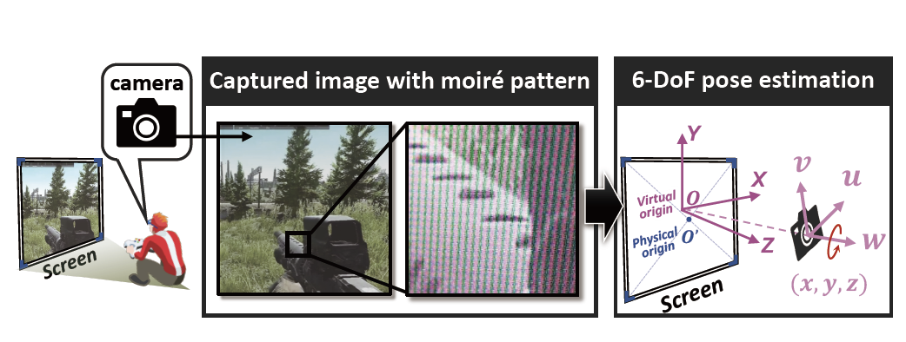
    <abbr class="badge">CVPR</abbr>
  

  

  
Expandable Subspace Ensemble for
Pre-Trained Model-Based Class-Incremental Learning

  
<strong>Da-Wei Zhou</strong>, Hai-Long Sun, Han-Jia Ye, De-Chuan Zhan

  
<em>The IEEE/CVF Conference on Computer Vision and Pattern Recognition. <strong><i style="color:#1e90ff">CVPR 2024</i></strong>. </em> 
  

 [<a href="https://arxiv.org/abs/2403.12030" target="_blank">Paper</a>] 
[<a href="https://github.com/sun-hailong/CVPR24-Ease">Code</a>] 
 
  

</li>

<li>

  

    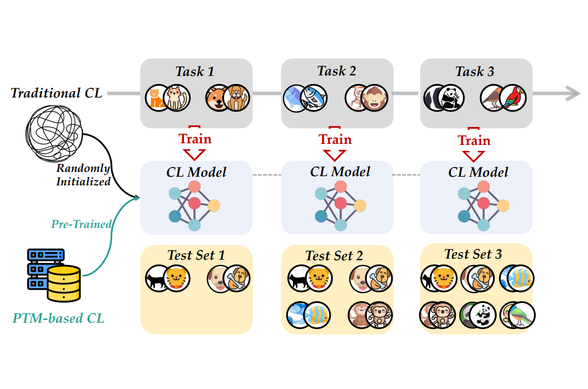
    <abbr class="badge">IJCAI</abbr> 
  

  

  
Continual Learning with Pre-Trained Models: A Survey

  
<strong>Da-Wei Zhou</strong>, Hai-Long Sun, Jingyi Ning, Han-Jia Ye, De-Chuan Zhan

  
<em> The 33rd International Joint
Conference on Artificial Intelligence. <strong><i style="color:#1e90ff">IJCAI 2024</i></strong>. </em> 
  

[<a href="https://arxiv.org/abs/2401.16386" target="_blank">Paper</a>]
[<a href="https://github.com/sun-hailong/LAMDA-PILOT">Code</a>]
[<a href="https://mp.weixin.qq.com/s/dWumvQxhlItc_Lo2uv4SEg">Media</a>]
 <!-- [<a href="https://zhuanlan.zhihu.com/p/681100367">中文解读</a>] -->
   
 
  

</li>

<li>

  

    
    <abbr class="badge">ICLR</abbr>
  

  

  
BEEF: Bi-Compatible Class-Incremental Learning via Energy-Based Expansion and Fusion 

  
Fu-Yun Wang, <strong>Da-Wei Zhou</strong>, Liu Liu, Yatao Bian, Han-Jia Ye, De-Chuan Zhan, Peilin Zhao

  
<em>The 11th International Conference on Learning Representations. <strong><i style="color:#1e90ff">ICLR 2023</i></strong>. </em> 
  

[<a href="https://openreview.net/forum?id=iP77_axu0h3" target="_blank">Paper</a>] 
[<a href="https://github.com/G-U-N/ICLR23-BEEF">Code</a>]
  

</li>

<li>

  

    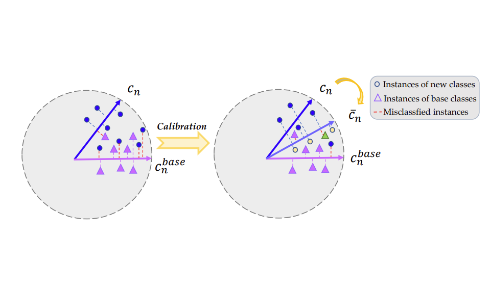
    <abbr class="badge">NeurIPS</abbr>
  

  

  
Few-Shot Class-Incremental Learning via Training-Free Prototype Calibration

  
Qi-Wei Wang, <strong>Da-Wei Zhou</strong>, Yi-Kai Zhang,  De-Chuan Zhan, Han-Jia Ye

  
<em>The 37th Conference on Neural Information Processing Systems. <strong><i style="color:#1e90ff">NeurIPS 2023</i></strong>. </em> 
  

[<a href="https://openreview.net/forum?id=8NAxGDdf7H" target="_blank">Paper</a>] 
[<a href="https://github.com/wangkiw/TEEN">Code</a>]
 
  

</li>

<li>

  

    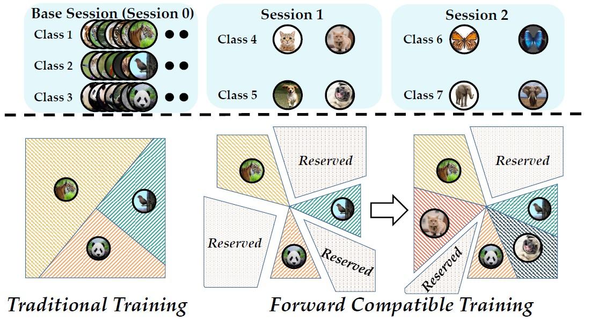
    <abbr class="badge">CVPR</abbr>
  

  

  
Forward Compatible Few-Shot Class-Incremental Learning

  
<strong>Da-Wei Zhou</strong>, Fu-Yun Wang, Han-Jia Ye, Liang Ma, Shiliang Pu, De-Chuan Zhan

  
<em>IEEE Conference on Computer Vision and Pattern Recognition. <strong><i style="color:#1e90ff">CVPR 2022</i></strong>.</em>
  

[<a href="https://arxiv.org/abs/2203.06953" target="_blank">Paper</a>]
[<a href="./file/CVPR22/CVPR22_project.html" target="_blank">Project Page</a>]
[<a href="https://github.com/zhoudw-zdw/CVPR22-Fact" target="_blank">Code</a>]
 
  

</li>

<li>

  

    
    <abbr class="badge">ECCV</abbr>
  

  

  
FOSTER: Feature Boosting and Compression for Class-Incremental Learning

  
Fu-Yun Wang, <strong>Da-Wei Zhou</strong>, Han-Jia Ye, De-Chuan Zhan

  
<em>European Conference on Computer Vision. <strong><i style="color:#1e90ff">ECCV 2022</i></strong>.</em>
  

[<a href="https://arxiv.org/abs/2204.04662" target="_blank">Paper</a>]
 [<a href="https://github.com/G-U-N/ECCV22-FOSTER">Code</a>]
  
  <!--  -->
  
  

</li>

<li>

  

    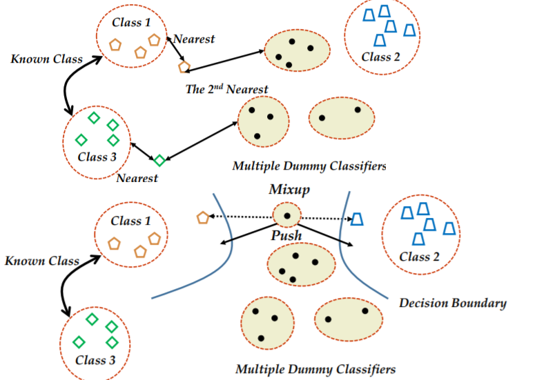
    <abbr class="badge">CVPR Oral</abbr>
  

  

  
Learning Placeholders for Open-Set Recognition

  
<strong>Da-Wei Zhou</strong>, Han-Jia Ye, De-Chuan Zhan

  
<em>IEEE Conference on Computer Vision and Pattern Recognition. <strong><i style="color:#1e90ff">CVPR 2021</i></strong>. </em> <strong><i style="color:#e74d3c">Oral Presentation</i></strong>
  

[<a href="https://arxiv.org/abs/2103.15086" target="_blank">Paper</a>]
[<a href="./file/CVPR21/CVPR21_project.html" target="_blank">Project Page</a>]
[<a href="https://github.com/zhoudw-zdw/CVPR21-Proser" target="_blank">Code</a>]
 

 
  

</li>

<li>

  

    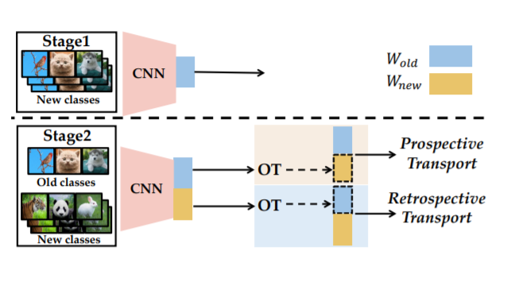
    <abbr class="badge">ACM MM</abbr>
  

  

  
Co-Transport for Class-Incremental Learning

  
<strong>Da-Wei Zhou</strong>, Han-Jia Ye, De-Chuan Zhan

  
<em>The 29th ACM International Conference on Multimedia.  <strong><i style="color:#1e90ff">ACM MM 2021</i></strong>.</em>
  

  [<a href="http://arxiv.org/abs/2107.12654" target="_blank">Paper</a>]
  [<a href="file/MM21/MM21_project.html" target="_blank">Project Page</a>]
  [<a href="https://github.com/zhoudw-zdw/MM21-Coil" target="_blank">Code</a>]
   
   
  

</li>

</ol>

### Journal Article

<ol class="bibliography">

<li>

  

    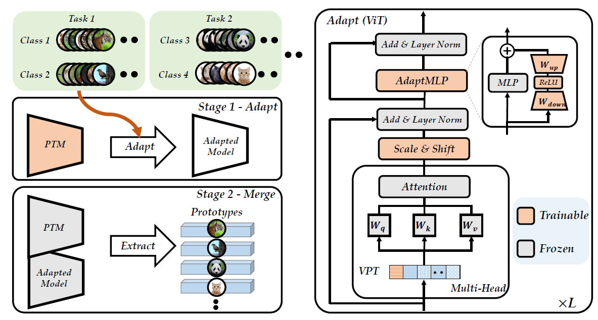
    <abbr class="badge">IJCV</abbr> 
  

  

  
Revisiting Class-Incremental Learning with Pre-Trained Models: Generalizability and Adaptivity are All You Need

  
<strong>Da-Wei Zhou</strong>, Zi-Wen Cai, Han-Jia Ye, De-Chuan Zhan, Ziwei Liu

  
<em>International Journal of Computer Vision. <strong><i style="color:#1e90ff">IJCV</i></strong>.</em>
  

[<a href="http://arxiv.org/abs/2303.07338" target="_blank">Paper</a>]
[<a href="https://github.com/zhoudw-zdw/RevisitingCIL">Code</a>]
[<a href="https://mp.weixin.qq.com/s/CACAaD2F1NvH4MJ1eCvpNA">Media</a>]
 
  

</li>

<li>

  

    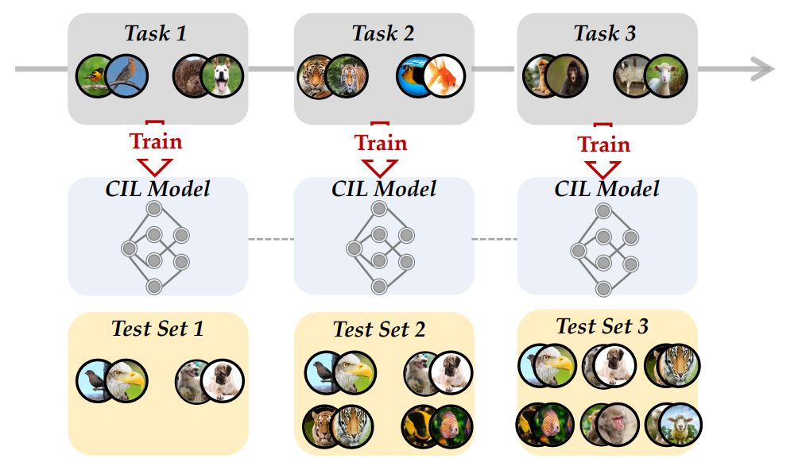
    <abbr class="badge">TPAMI</abbr> 
  

  

  
Class-Incremental Learning: A Survey

  
<strong>Da-Wei Zhou</strong>, Qi-Wei Wang, Zhi-Hong Qi, Han-Jia Ye, De-Chuan Zhan, Ziwei Liu

    
<em>IEEE Transactions on Pattern Analysis and Machine Intelligence. <strong><i style="color:#1e90ff">TPAMI</i></strong>.</em>  
  

[<a href="https://arxiv.org/abs/2302.03648" target="_blank">Paper</a>]
[<a href="https://github.com/zhoudw-zdw/CIL_Survey">Code</a>]
[<a href="https://mp.weixin.qq.com/s/n3MwLm8MpuXeE4o-D7H0jw">Media</a>]
 [<a href="https://zhuanlan.zhihu.com/p/605208282">中文解读</a>]
   
 
 
  

</li>

<li>

  

    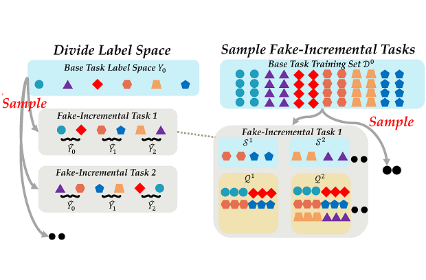
    <abbr class="badge">TPAMI</abbr>
  

  

  
Few-Shot Class-Incremental Learning by
Sampling Multi-Phase Tasks

  
<strong>Da-Wei Zhou</strong>, Han-Jia Ye, Liang Ma, Di Xie, Shiliang Pu, De-Chuan Zhan

  
<em>IEEE Transactions on Pattern Analysis and Machine Intelligence. <strong><i style="color:#1e90ff">TPAMI</i></strong>.</em> <strong><i style="color:#e74d3c">ESI Highly Cited Paper</i></strong>
  

 [<a href="https://arxiv.org/abs/2203.17030" target="_blank">Paper</a>]
[<a href="https://github.com/zhoudw-zdw/Limit" target="_blank">Code</a>]
 
 
  

</li>

<li>

  

    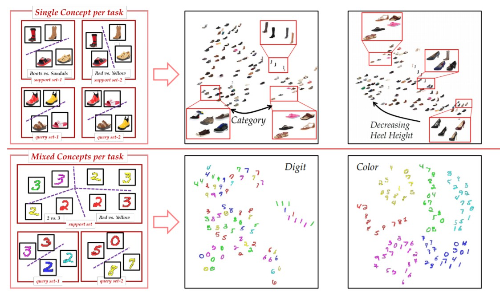
    <abbr class="badge">TPAMI</abbr> 
  

  

  
Contextualizing Meta-Learning via Learning to Decompose

  
Han-Jia Ye, <strong>Da-Wei Zhou</strong>, Lanqing Hong, Zhenguo Li, Xiu-Shen Wei, De-Chuan Zhan

  
<em>IEEE Transactions on Pattern Analysis and Machine Intelligence. <strong><i style="color:#1e90ff">TPAMI</i></strong>.</em>  
  

 [<a href="https://arxiv.org/abs/2106.08112" target="_blank">Paper</a>]
 [<a href="https://github.com/zhoudw-zdw/LeadNet" target="_blank">Code</a>]
  

</li>

<li>

  

    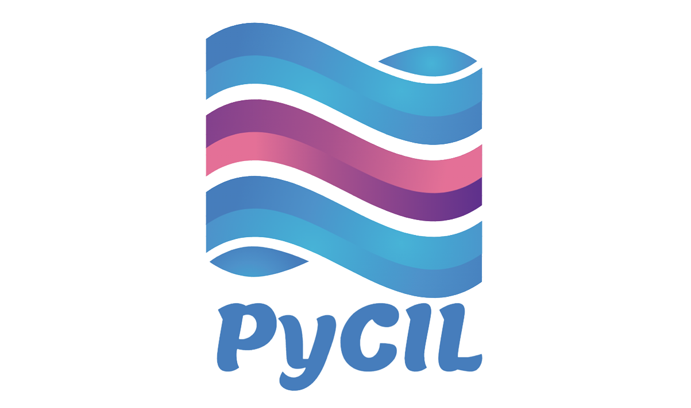
    <abbr class="badge">SCIS</abbr>
  

  

  
PyCIL: A Python Toolbox for Class-Incremental Learning

  
<strong>Da-Wei Zhou*</strong>, Fu-Yun Wang*, Han-Jia Ye, De-Chuan Zhan 

  
<em>SCIENCE CHINA Information Sciences. <strong><i style="color:#1e90ff">SCIS</i></strong>.</em>
  

 [<a href="https://arxiv.org/abs/2112.12533" target="_blank">Paper</a>]
 [<a href="https://github.com/G-U-N/PyCIL">Code</a>] 
 [<a href="https://mp.weixin.qq.com/s/A472p7XGZMhAMAR2wyHZJw">Media</a>] 
 [<a href="https://mp.weixin.qq.com/s/h1qu2LpdvjeHAPLOnG478A">中文解读</a>]
  

  

</li>

</ol>

<!-- ## Contact

- **Office**: Room A202, Yifu Building, Nanjing University Xianlin Campus. 
- **Email**: zhoudw (at) lamda.nju.edu.cn **OR** zhoudw  (at) nju.edu.cn -->
