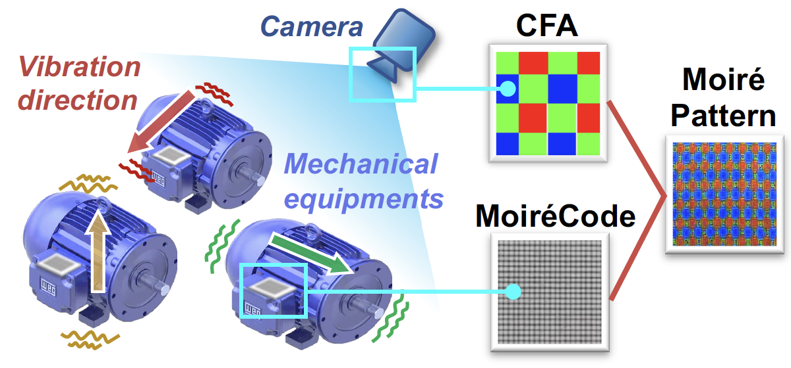
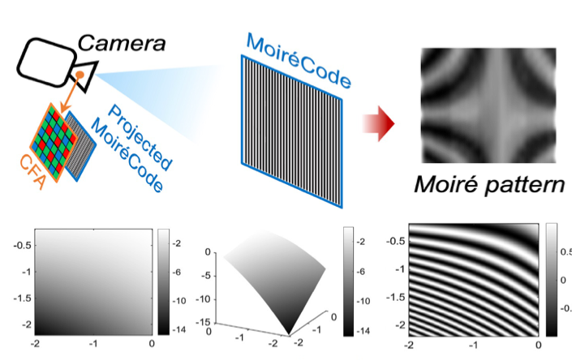
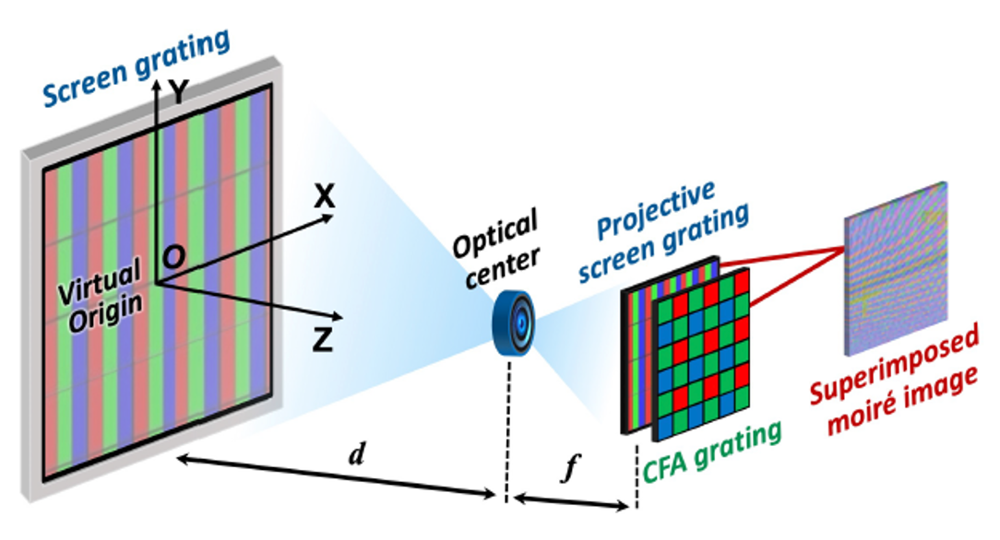
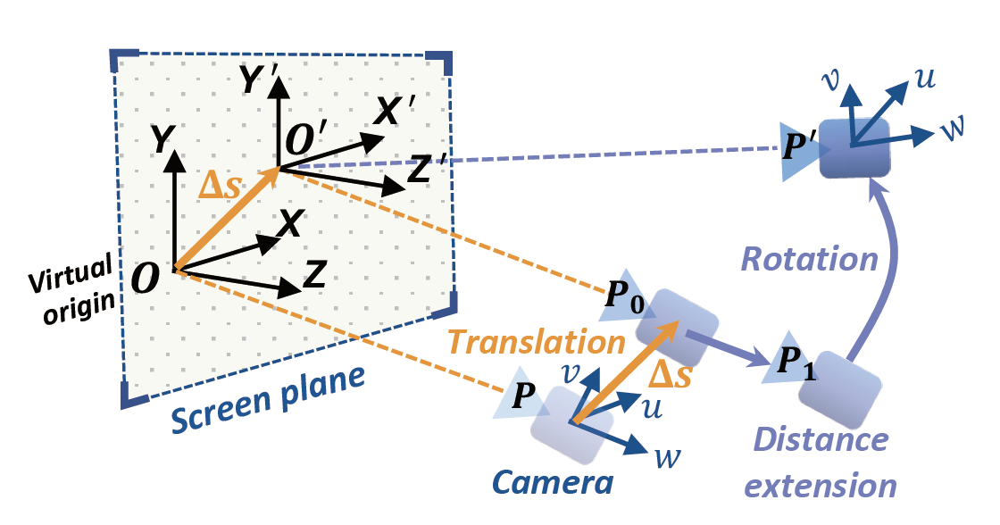
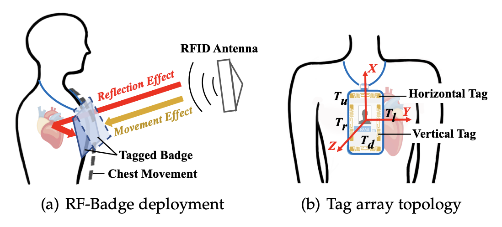
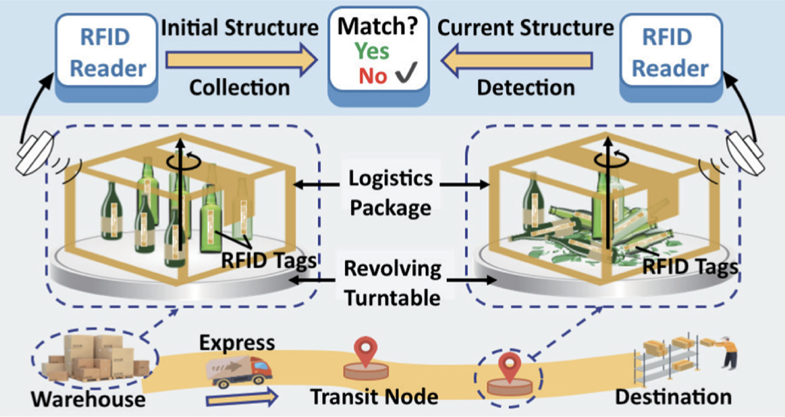

## Short Bio

I am an Assistant Researcher (2024-) in the [School of Computer Science](https://cs.nju.edu.cn/main.htm) at [Nanjing University](http://www.nju.edu.cn/).  
Previously, I received my Ph.D. (2018-2024) from the <a href="https://dislab.nju.edu.cn/">DIStributed computing LABoratory (DISLAB)</a>,
<a href="https://cs.nju.edu.cn/main.htm">School of Computer Science</a> of Nanjing University, supervised by Prof. <a href="https://cs.nju.edu.cn/lxie/index.htm">Lei Xie</a> and Prof. <a href="https://cs.nju.edu.cn/yebl/index.htm">Baoliu Ye</a>. I was fortunate to visit Nanyang Technological University in Singapore (2022-2023), working closely with Prof. <a href="https://personal.ntu.edu.sg/junluo/">Jun Luo</a>.

My research interests include Intelligent Sensing, Mobile Computing, and Wireless Sensing.

  <i class="fa-regular fa-bell"></i>&nbsp;
I am looking for highly self-motivated students. Please drop me an email with your resume and transcript if you are interested in working together with me.

## News

  <li>[2024-09] One paper about Millimeter-wave Sensing is accepted by <a href="https://sigchi.org/events/ubicomp-iswc-2025/" target="_blank">ACM UbiComp 2025</a>.</li>
  <li>[2024-09] One paper about RFID Sensing is accepted by <a href="https://dl.acm.org/journal/health" target="_blank">ACM TCH</a>.</li>
  <li>[2024-09] Successfully defended my Ph.D. dissertation.</li>
  <li>[2024-08] One paper about Moire Vision Sensing is accepted by <a href="https://www.sigmobile.org/mobicom/2024/" target="_blank">ACM MobiCom 2024</a>.</li>
  <li>[2024-06] Recognized as Jiangsu Outstanding Graduate.</li>
  <li>[2024-05] One paper about Moire Vision Sensing is accepted by <a href="https://www.comsoc.org/publications/journals/ieee-jsac" target="_blank">IEEE JSAC</a>.</li>
  <li>[2024-04] One paper about RFID Sensing is accepted by <a href="https://icdcs2024.icdcs.org/" target="_blank">IEEE ICDCS 2024</a>.</li>
  <li>[2024-02] One paper about Moire Vision Sensing is accepted by <a href="https://www.sigmobile.org/mobicom/2024/" target="_blank">ACM MobiCom 2024</a>.</li>
  <!-- <li>[2023-12] Outstanding Ph.D. Student Innovation Capability Enhancement Program A of Nanjing University.</li>
  <li>[2022-12] Person of the Year Nominee of Nanjing University.</li> -->

## Selected Publications 

For more details, please view the <a href="./publication.html">full publication page.
<!-- </a> or <a href="https://scholar.google.com/citations?user=kMNaR-YAAAAJ&hl=en" target="_blank">Google Scholar profile</a>.  -->

### Conference Paper

<ol class="bibliography">

<li>
  

    

      
      <abbr class="badge">MobiCom</abbr>
    

    

    
MoiréVib: Micron-level Vibration Detection based on Moiré Pattern.

    
<strong>Jingyi Ning</strong>, Zhihao Yan, Zhaowei Wu, Lei Xie, Chuyu Wang, Yingying Chen, Baoliu Ye and Sanglu Lu.

    
<em>In Proceeding of the 30th Annual International Conference on Mobile Computing and Networking. <strong><i style="color:#1e90ff">MobiCom 2024</i></strong>. </em> 
    

   [<a href="" target="_blank">Paper</a>] 
   
    

  

</li>

<li>
  

    

      
      <abbr class="badge">MobiCom</abbr>
    

    

    
MoiréVision: A Generalized Moiré-based Mechanism for 6-DoF Motion Sensing.

    
<strong>Jingyi Ning</strong>, Lei Xie, Zhihao Yan, Yanling Bu, and Jun Luo.

    
<em>In Proceeding of the 30th Annual International Conference on Mobile Computing and Networking. <strong><i style="color:#1e90ff">MobiCom 2024</i></strong>. </em> 
    

   [<a href="https://dl.acm.org/doi/10.1145/3636534.3649374" target="_blank">Paper</a>] 
   
    

  

</li>

<li>

  

    
    <abbr class="badge">MobiCom</abbr>
  

  

  
MoiréPose: Ultra High Precision Camera-to-Screen Pose Estimation based on Moiré Pattern

  
<strong>Jingyi Ning</strong>, Lei Xie, Yi Li, Yingying Chen, Yanling Bu, Baoliu Ye, and Sanglu Lu.

  
<em>In Proceeding of the 28th Annual International Conference on Mobile Computing and Networking. <strong><i style="color:#1e90ff">MobiCom 2022</i></strong>. </em> 
  

  [<a href="https://dl.acm.org/doi/abs/10.1145/3495243.3560537" target="_blank">Paper</a>] 
   
  

</li>

</ol>

### Journal Article

<ol class="bibliography">

<li>

  

    
    <abbr class="badge">JSAC</abbr> 
  

  

  
MoiréTracker: Continuous Camera-to-Screen 6-DoF Pose Tracking based on Moiré Pattern

  
<strong>Jingyi Ning</strong>, Lei Xie,Yi Li ,Yingying Chen ,Yanling Bu, Chuyu Wang, Sanglu Lu and Baoliu Ye.

    
<em>IEEE Journal on Selected Areas in Communications. <strong><i style="color:#1e90ff">JSAC</i></strong>, 2024.</em>  
  

  [<a href="https://ieeexplore.ieee.org/document/10557737" target="_blank">Paper</a>]
   
  

</li>

<li>

  

    
    <abbr class="badge">TMC</abbr>
  

  

  
RF-Badge: Vital Sign-based Authentication via RFID Tag Array on Badges.

  
<strong>Jingyi Ning</strong>, Lei Xie, Chuyu Wang, Yanling Bu, Fengyuan Xu, Da-wei Zhou, Sanglu Lu, and Baoliu Ye.

  
<em>IEEE Transactions on Mobile Computing. <strong><i style="color:#1e90ff">TMC</i></strong>, 2021.</em> 
  

 [<a href="https://ieeexplore.ieee.org/document/9490377" target="_blank">Paper</a>]
 
  

</li>

<li>

  

    
    <abbr class="badge">TOSN</abbr>
  

  

  
Revolving Scanning on Tagged Objects: 3D Structure Detection of Logistics Packages via RFID systems.

  
<strong>Jingyi Ning</strong>, Lei Xie, Chuyu Wang, Yanling Bu, Fu Xiao, Baoliu Ye, Sanglu Lu.

  
<em>ACM Transactions on Sensor Networks. <strong><i style="color:#1e90ff">TOSN</i></strong>, 2022.</em> 
  

 [<a href="https://dl.acm.org/doi/10.1145/3490171" target="_blank">Paper</a>]
 
  

</li>

  

</ol>

<!-- ## Contact

- **Office**: Room 619, School of Computer Science, Nanjing University Xianlin Campus. 
- **Email**: ningjy (at) nju.edu.cn  -->
